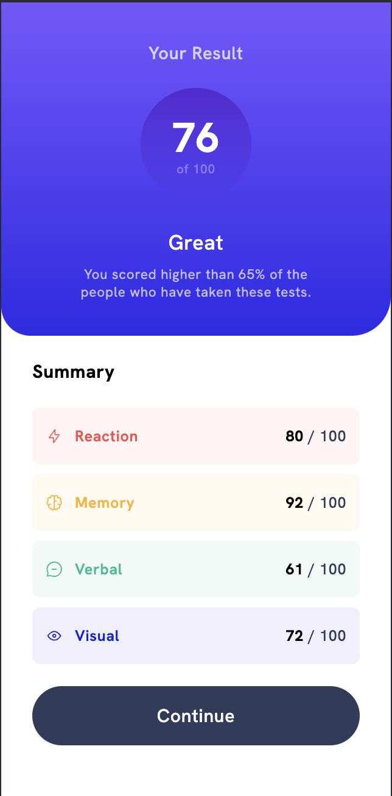
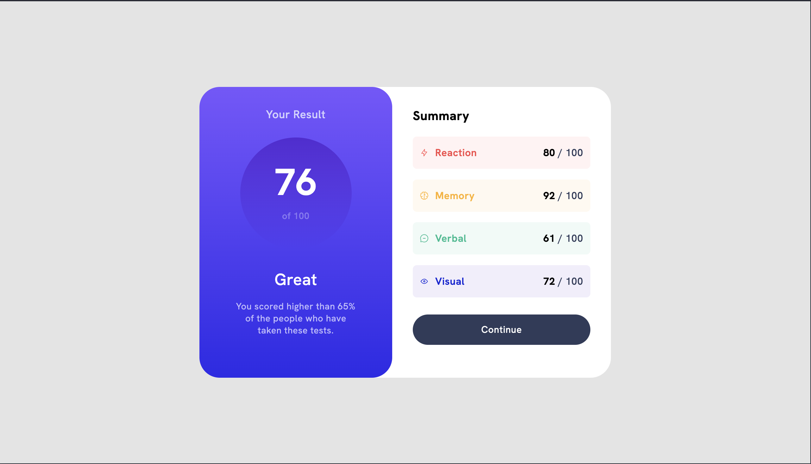

# Frontend Mentor - Results summary component solution

This is a solution to the [Results summary component challenge on Frontend Mentor](https://www.frontendmentor.io/challenges/results-summary-component-CE_K6s0maV). Frontend Mentor challenges help you improve your coding skills by building realistic projects.

## Table of contents

-   [Overview](#overview)
    -   [The challenge](#the-challenge)
    -   [Screenshot](#screenshot)
    -   [Links](#links)
-   [My process](#my-process)
    -   [Built with](#built-with)
    -   [What I learned](#what-i-learned)
    -   [Continued development](#continued-development)
    -   [Useful resources](#useful-resources)
-   [Author](#author)

## Overview

### The challenge

Users should be able to:

-   View the optimal layout for the interface depending on their device's screen size
-   See hover and focus states for all interactive elements on the page
-   **Bonus**: Use the local JSON data to dynamically populate the content

### Screenshot




### Links

-   Solution URL: [Add solution URL here](https://your-solution-url.com)
-   Live Site URL: [Add live site URL here](https://your-live-site-url.com)

## My process

### Built with

-   Semantic HTML5 markup
-   CSS custom properties
-   Flexbox
-   Vanilla Javascript

**Note: These are just examples. Delete this note and replace the list above with your own choices**

### What I learned

I mastered how to use clamp for responsive typography, and responsive elements. I also learned how to make beautiful looking elements with gradients.

```css
/* *example of code with clamp */
span.avg-score {
    top: clamp(1rem, 20%, 2rem);
    left: 0;
    right: 0;
    font-size: clamp(2.125rem, 10.5vw, 3.7rem);
    color: white;
}
```

```css
/* example of using a gradients */
section.result-section,
button.continue-btn:hover {
    background-image: linear-gradient(
        var(--light-slate-blue),
        var(--light-royal-blue)
    );
}
```

I also learned how use a self-invoking function in Javascript.

```js
(async function () {
    //does something...
})();
```

### Continued development

I want to keep on mastering responsive design with clamp, and make colors look even more visually appealing with gradients.

### Useful resources

-   [Example resource 1](https://www.w3schools.com/) - The documentation helped me really understand gradients, and just refresh basic css concepts in general.

## Author

-   Frontend Mentor - [@@EtFX1](https://www.frontendmentor.io/profile/EtFX1)
-   Github - [@EtFX1](https://github.com/EtFX1)
